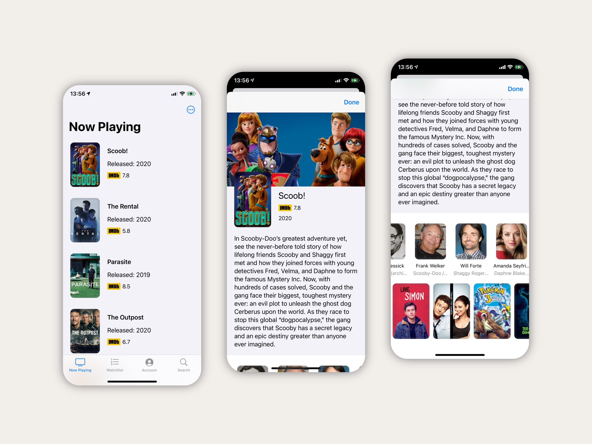
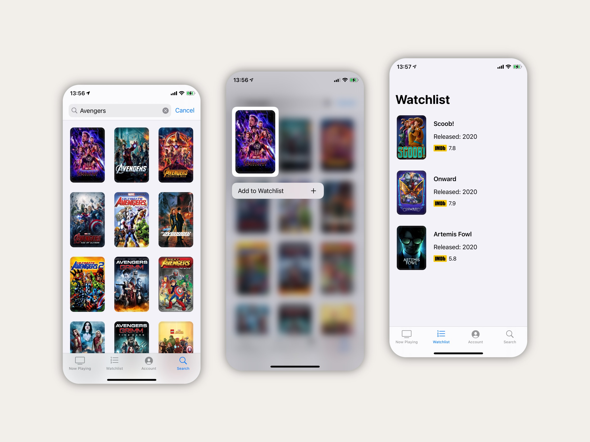

# MoviesInfo
This app is a showcase of some of the things I'm capable of doing. It's not a fully feature app.

## Screenshots

  
  

## Features
* TMBD API integration.
* 100% programatic UI.
* TableViews & CollectionViews with custom cells.
* Diffable dataSource implementation for CollectionView.
* ScrollViews.
* Child ViewControllers.
* URLSession API for network calls.
* OAuth (Pending).
* Image caching.
* Search functionality for movies.
* Dark mode.
